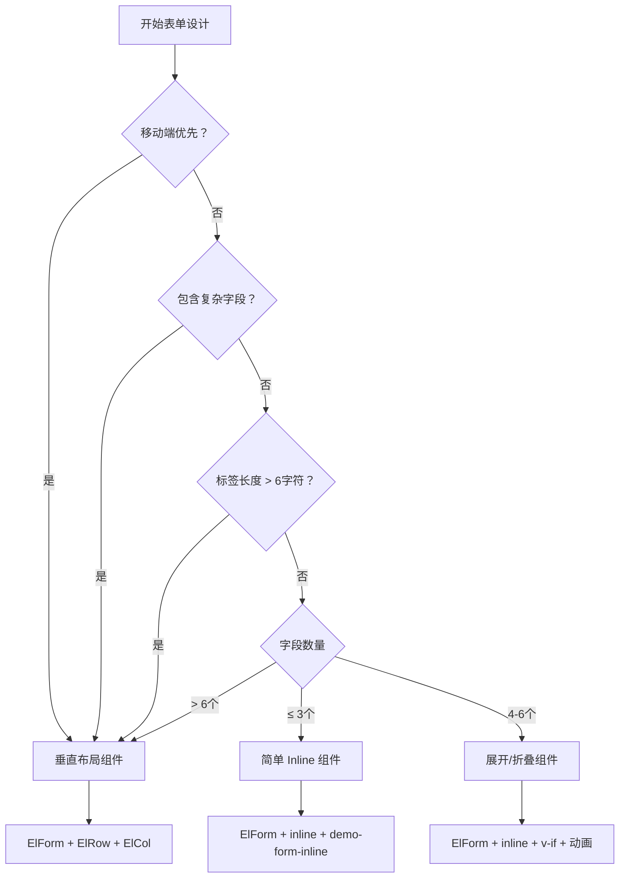

# 表单组件决策指南

## 概述

本文档是 Vue 3 + Element Plus 项目中表单组件的决策指南，帮助开发者根据具体场景选择合适的表单组件和布局模式。重点关注如何根据业务需求和技术约束做出最优的组件选择决策。

## 表单组件决策矩阵

### 1. 搜索表单组件选择

在 CRUD 页面中，表单组件的选择直接影响用户体验和开发效率。基于字段数量和复杂度进行组件决策：

#### 组件选择决策树

✅ **ElForm + Inline 模式**
- **使用场景**：字段数量 ≤ 4个，标签长度 ≤ 6字符
- **优势**：界面简洁，操作便捷，符合用户预期
- **组件**：`<el-form inline>` + `demo-form-inline` 样式

✅ **ElForm + 展开/折叠模式**
- **使用场景**：字段数量 > 4个，核心字段 ≤ 3个
- **优势**：保持界面简洁，功能完整
- **组件**：`<el-form inline>` + `v-if` 条件渲染 + 动画控制

✅ **ElForm + 垂直布局模式**
- **使用场景**：复杂字段，标签过长，移动端优先
- **优势**：布局灵活，适配性强
- **组件**：`<el-form>` + `<el-row>` + `<el-col>`

### 2. 组件选择快速参考表

| 业务场景 | 字段数量 | 推荐组件 | 布局模式 | 实现复杂度 |
|---------|---------|---------|---------|-----------|
| 简单搜索 | ≤ 3个 | `ElForm` + `inline` | 行内布局 | ⭐ |
| 标准搜索 | 4-6个 | `ElForm` + `inline` + 展开/折叠 | 行内+展开 | ⭐⭐ |
| 复杂筛选 | > 6个 | `ElForm` + `ElRow/ElCol` | 网格布局 | ⭐⭐⭐ |
| 数据录入 | 不限 | `ElForm` + `垂直布局` | 垂直布局 | ⭐⭐ |
| 移动端优先 | 不限 | `ElForm` + `响应式布局` | 自适应布局 | ⭐⭐⭐ |

### 3. 核心组件模式详解

#### 模式一：简单 Inline 表单组件

**适用场景**：字段数量 ≤ 4个，标签简短，快速操作

**组件组合**：
```vue
<!-- 核心组件 -->
<el-form inline class="demo-form-inline">
  <el-form-item>
    <el-input class="demo-input" />
  </el-form-item>
  <el-form-item>
    <el-button type="primary" />
  </el-form-item>
</el-form>
```

**决策要点**：
- ✅ 界面简洁，符合用户预期
- ✅ 开发效率高，代码量少
- ✅ 移动端友好度一般
- ❌ 字段扩展性差

#### 模式二：展开/折叠表单组件

**适用场景**：字段数量 > 4个，有主次字段之分

**组件组合**：
```vue
<!-- 核心组件 -->
<el-form inline class="demo-form-inline" :class="{ 'expanded': isExpanded }">
  <!-- 默认显示字段 -->
  <el-form-item><el-input /></el-form-item>

  <!-- 条件显示字段 -->
  <template v-if="isExpanded">
    <el-form-item><el-input /></el-form-item>
  </template>

  <!-- 控制组件 -->
  <el-button link @click="toggleExpanded">
    {{ isExpanded ? '收起' : '展开' }}
  </el-button>
</el-form>
```

**决策要点**：
- ✅ 界面简洁，功能完整
- ✅ 渐进式功能展示
- ✅ 用户体验良好
- ❌ 需要额外的状态管理

#### 模式三：垂直网格表单组件

**适用场景**：复杂字段，长标签，移动端优先

**组件组合**：
```vue
<!-- 核心组件 -->
<el-form label-width="100px">
  <el-row :gutter="20">
    <el-col :span="8">
      <el-form-item>
        <el-input style="width: 100%" />
      </el-form-item>
    </el-col>
    <el-col :span="8">
      <el-form-item>
        <el-select style="width: 100%" />
      </el-form-item>
    </el-col>
  </el-row>
</el-form>
```

**决策要点**：
- ✅ 布局灵活性最高
- ✅ 响应式适配最佳
- ✅ 支持复杂字段类型
- ❌ 开发复杂度较高
- ❌ 界面占用空间大

### 4. 展开/折叠模式组件实现

#### **组件决策原则**：
- 搜索字段数量 > 4个
- 核心搜索字段 ≤ 3个（默认显示）
- 扩展字段为次要筛选条件
- 需要保持界面简洁，同时提供完整的搜索能力

#### **完整组件实现**

```vue
<template>
  <div class="search-section">
    <el-form
      :model="searchForm"
      inline
      @submit.prevent="handleSearch"
      class="demo-form-inline"
      :class="{ 'expanded': isExpanded }"
    >
      <!-- 核心字段（默认显示） -->
      <el-form-item label="关键词">
        <el-input
          v-model="searchForm.keyword"
          placeholder="用户名/邮箱/手机号"
          clearable
          class="demo-input"
        />
      </el-form-item>

      <el-form-item label="角色">
        <el-select
          v-model="searchForm.role"
          placeholder="全部角色"
          clearable
          class="demo-select"
        >
          <el-option label="管理员" value="admin" />
          <el-option label="编辑者" value="editor" />
          <el-option label="普通用户" value="user" />
        </el-select>
      </el-form-item>

      <el-form-item label="状态">
        <el-select
          v-model="searchForm.status"
          placeholder="全部状态"
          clearable
          class="demo-select"
        >
          <el-option label="正常" value="active" />
          <el-option label="禁用" value="inactive" />
          <el-option label="封禁" value="banned" />
        </el-select>
      </el-form-item>

      <!-- 扩展字段（折叠时隐藏） -->
      <template v-if="isExpanded">
        <el-form-item label="部门">
          <el-select
            v-model="searchForm.department"
            placeholder="全部部门"
            clearable
            class="demo-select"
          >
            <el-option label="技术部" value="tech" />
            <el-option label="产品部" value="product" />
            <el-option label="运营部" value="operation" />
            <el-option label="市场部" value="marketing" />
          </el-select>
        </el-form-item>

        <el-form-item label="注册时间">
          <el-date-picker
            v-model="searchForm.registerDateRange"
            type="daterange"
            range-separator="至"
            start-placeholder="开始日期"
            end-placeholder="结束日期"
            class="demo-date-picker"
          />
        </el-form-item>

        <el-form-item label="最后登录">
          <el-date-picker
            v-model="searchForm.lastLoginDateRange"
            type="daterange"
            range-separator="至"
            start-placeholder="开始日期"
            end-placeholder="结束日期"
            class="demo-date-picker"
          />
        </el-form-item>

        <el-form-item label="用户来源">
          <el-select
            v-model="searchForm.source"
            placeholder="全部来源"
            clearable
            class="demo-select"
          >
            <el-option label="网站注册" value="web" />
            <el-option label="移动端" value="mobile" />
            <el-option label="第三方登录" value="oauth" />
            <el-option label="邀请注册" value="invite" />
          </el-select>
        </el-form-item>
      </template>

      <!-- 操作按钮 -->
      <el-form-item>
        <el-button type="primary" native-type="submit" :loading="loading">
          搜索
        </el-button>
        <el-button @click="handleReset">重置</el-button>

        <!-- 展开/折叠按钮 -->
        <el-button
          type="primary"
          link
          @click="toggleExpanded"
          class="expand-button"
        >
          {{ isExpanded ? '收起' : '展开' }}
          <el-icon class="expand-icon" :class="{ 'expanded': isExpanded }">
            <ArrowDown />
          </el-icon>
        </el-button>
      </el-form-item>
    </el-form>
  </div>
</template>

<script setup lang="ts">
import { ref } from 'vue'
import { ArrowDown } from '@element-plus/icons-vue'

interface SearchForm {
  keyword: string
  role: string
  status: string
  department: string
  registerDateRange: [Date, Date] | null
  lastLoginDateRange: [Date, Date] | null
  source: string
}

const searchForm = reactive<SearchForm>({
  keyword: '',
  role: '',
  status: '',
  department: '',
  registerDateRange: null,
  lastLoginDateRange: null,
  source: ''
})

const loading = ref(false)
const isExpanded = ref(false)

const toggleExpanded = () => {
  isExpanded.value = !isExpanded.value
}

const handleSearch = async () => {
  loading.value = true
  try {
    // 搜索逻辑
    await new Promise(resolve => setTimeout(resolve, 1000))
  } finally {
    loading.value = false
  }
}

const handleReset = () => {
  // 重置表单逻辑
  Object.keys(searchForm).forEach(key => {
    if (Array.isArray(searchForm[key])) {
      searchForm[key] = null
    } else {
      searchForm[key] = ''
    }
  })
}
</script>

<style scoped>
/* Element Plus 官方 inline 表单样式 */
.demo-form-inline .el-input {
  --el-input-width: 220px;
}

.demo-form-inline .el-select {
  --el-select-width: 220px;
}

.demo-form-inline .el-date-picker {
  --el-date-picker-width: 280px;
}

/* 展开/折叠动画 */
.demo-form-inline {
  transition: all 0.3s ease;
}

.demo-form-inline .el-form-item {
  transition: all 0.3s ease;
}

/* 折叠状态下隐藏扩展字段 */
.demo-form-inline:not(.expanded) .el-form-item:nth-child(n+4):not(:last-child) {
  display: none;
}

/* 展开/折叠按钮样式 */
.expand-button {
  margin-left: 8px;
  transition: all 0.3s ease;
}

.expand-icon {
  transition: transform 0.3s ease;
  margin-left: 4px;
}

.expand-icon.expanded {
  transform: rotate(180deg);
}

/* 响应式适配 */
@media (max-width: 1200px) {
  .demo-form-inline .el-input {
    --el-input-width: 180px;
  }

  .demo-form-inline .el-select {
    --el-select-width: 180px;
  }
}

@media (max-width: 768px) {
  .demo-form-inline {
    display: block;
  }

  .demo-form-inline .el-form-item {
    display: block;
    margin-bottom: 16px;
  }

  .demo-form-inline .el-form-item:nth-child(n+4):not(:last-child) {
    display: block !important;
  }
}
</style>
```

### 5. 组件选择决策流程

#### 组件决策算法

```typescript
/**
 * 表单组件决策函数
 * @param fieldCount 字段数量
 * @param hasComplexFields 是否包含复杂字段（日期范围、级联选择器等）
 * @param labelLength 平均标签长度
 * @param isMobileFirst 是否移动端优先
 * @returns 推荐的组件类型
 */
function decideFormComponent(
  fieldCount: number,
  hasComplexFields: boolean,
  labelLength: number,
  isMobileFirst: boolean
): string {
  // 优先级1：移动端优先 → 垂直布局
  if (isMobileFirst) {
    return 'vertical-layout'
  }

  // 优先级2：复杂字段 → 垂直布局
  if (hasComplexFields) {
    return 'vertical-layout'
  }

  // 优先级3：标签过长 → 垂直布局
  if (labelLength > 6) {
    return 'vertical-layout'
  }

  // 优先级4：字段数量决策
  if (fieldCount <= 3) {
    return 'simple-inline'
  } else if (fieldCount <= 6) {
    return 'expand-collapse'
  } else {
    return 'vertical-layout'
  }
}
```

#### 可视化决策流程



### 6. 组件使用最佳实践

#### 开发决策清单

在开始表单开发前，使用以下清单进行组件选择决策：

```markdown
□ 1. 业务场景分析
   □ 搜索/筛选用途？
   □ 数据录入用途？
   □ 表单复杂度评估？

□ 2. 技术约束分析
   □ 字段总数：____ 个
   □ 核心字段：____ 个
   □ 扩展字段：____ 个
   □ 最长标签：____ 字符
   □ 是否包含复杂控件：□是 □否

□ 3. 用户体验需求
   □ 移动端优先：□是 □否
   □ 界面简洁度：□高 □中 □低
   □ 操作频率：□高 □中 □低

□ 4. 组件选择决策
   □ 推荐组件：__________________
   □ 实现复杂度：⭐ ~ ⭐⭐⭐
   □ 开发时间估算：____ 小时
```

#### 组件维护性考虑

**代码复用性**：
- ✅ 提取通用表单组件
- ✅ 统一样式规范
- ✅ 响应式适配

**性能优化**：
- ✅ 懒加载复杂组件
- ✅ 表单验证防抖
- ✅ 合理使用计算属性

**可测试性**：
- ✅ 组件单元测试
- ✅ 表单交互测试
- ✅ 响应式布局测试

## 7. 表单组件选择总结

### 核心决策原则

根据字段数量和技术约束，选择最适合的表单组件：

| 字段数量 | 推荐组件 | 实现复杂度 | 移动端友好 | 功能完整性 |
|---------|---------|-----------|-----------|-----------|
| ≤ 3个 | 简单 Inline | ⭐ | ⭐⭐ | ⭐⭐⭐ |
| 4-6个 | 展开/折叠 | ⭐⭐ | ⭐⭐ | ⭐⭐⭐ |
| > 6个 | 垂直布局 | ⭐⭐⭐ | ⭐⭐⭐ | ⭐⭐⭐ |

### 组件选择指导

1. **简单 Inline 组件**：快速开发，界面简洁，适用于基础搜索场景
2. **展开/折叠组件**：平衡简洁性和功能性，适用于中等复杂度搜索
3. **垂直布局组件**：功能最完整，适用于复杂表单和数据录入

### 开发效率与用户体验平衡

- **开发效率**：简单 Inline > 展开/折叠 > 垂直布局
- **用户体验**：垂直布局 > 展开/折叠 > 简单 Inline
- **推荐策略**：根据业务复杂度选择，优先保证用户体验

通过这套决策指南，开发者可以快速、准确地选择最适合当前业务场景的表单组件，确保开发效率和用户体验的最佳平衡。

## 最佳实践：响应式表单布局

### 栅格布局比例分配

**推荐布局比例：**
```vue
<el-row :gutter="16">
  <!-- 固定宽度布局 -->
  <el-col :xs="24" :sm="12" :md="6">
    <el-form-item label="关键词">
      <el-input
        v-model="localModel.keyword"
        placeholder="用户名/邮箱/手机号"
        clearable
        style="width: 200px"
        @clear="handleSubmit"
        @keyup.enter="handleSubmit"
      />
    </el-form-item>
  </el-col>

  <el-col :xs="24" :sm="12" :md="6">
    <el-form-item label="角色">
      <el-select
        v-model="localModel.role"
        placeholder="全部角色"
        clearable
        style="width: 200px"
        @change="handleSubmit"
      >
        <el-option
          v-for="option in roleOptions"
          :key="option.value"
          :label="option.label"
          :value="option.value"
        />
      </el-select>
    </el-form-item>
  </el-col>

  <el-col :xs="24" :sm="12" :md="6">
    <el-form-item label="状态">
      <el-select
        v-model="localModel.status"
        placeholder="全部状态"
        clearable
        style="width: 200px"
        @change="handleSubmit"
      >
        <el-option
          v-for="option in statusOptions"
          :key="option.value"
          :label="option.label"
          :value="option.value"
        />
      </el-select>
    </el-form-item>
  </el-col>

  <!-- 操作按钮 -->
  <el-col :xs="24" :sm="12" :md="6">
    <el-form-item>
      <el-button type="primary" native-type="submit" :loading="loading">
        搜索
      </el-button>
      <el-button @click="handleReset">重置</el-button>
    </el-form-item>
  </el-col>
</el-row>
```

### 响应式CSS样式

```css
/* 移动端适配 - 固定宽度在移动端改为100% */
@media (max-width: 768px) {
  .search-form :deep(.el-input),
  .search-form :deep(.el-select) {
    width: 100% !important;
  }
}
```

### 布局效果

**实际效果：**
- 桌面端：所有表单项固定200px宽度，样式统一
- 移动端：自适应100%宽度，便于触摸操作

**布局优势：**
- 固定宽度确保所有组件视觉效果完全一致
- 避免了百分比宽度导致的计算问题
- 移动端自动适配为全宽度布局
- 简单可靠，易于维护