# 表单组件决策指南

## 概述

本文档是 Vue 3 + Element Plus 项目中表单组件的决策指南，帮助开发者根据具体场景选择合适的表单组件和布局模式。重点关注如何根据业务需求和技术约束做出最优的组件选择决策。

## 表单组件决策矩阵

### 1. 搜索表单组件选择

在 CRUD 页面中，表单组件的选择直接影响用户体验和开发效率。基于字段数量和复杂度进行组件决策：

#### 组件选择决策树

✅ **ElForm + Inline 模式**
- **使用场景**：字段数量 ≤ 4个，标签长度 ≤ 6字符
- **优势**：界面简洁，操作便捷，符合用户预期
- **组件**：`<el-form inline>` + `demo-form-inline` 样式

✅ **ElForm + 展开/折叠模式**
- **使用场景**：字段数量 > 4个，核心字段 ≤ 3个
- **优势**：保持界面简洁，功能完整
- **组件**：`<el-form inline>` + `v-if` 条件渲染 + 动画控制

✅ **ElForm + 垂直布局模式**
- **使用场景**：复杂字段，标签过长，移动端优先
- **优势**：布局灵活，适配性强
- **组件**：`<el-form>` + `<el-row>` + `<el-col>`

### 2. 组件选择快速参考表

| 业务场景 | 字段数量 | 推荐组件 | 布局模式 | 实现复杂度 |
|---------|---------|---------|---------|-----------|
| 简单搜索 | ≤ 3个 | `ElForm` + `inline` | 行内布局 | ⭐ |
| 标准搜索 | 4-6个 | `ElForm` + `inline` + 展开/折叠 | 行内+展开 | ⭐⭐ |
| 复杂筛选 | > 6个 | `ElForm` + `ElRow/ElCol` | 网格布局 | ⭐⭐⭐ |
| 数据录入 | 不限 | `ElForm` + `垂直布局` | 垂直布局 | ⭐⭐ |
| 移动端优先 | 不限 | `ElForm` + `响应式布局` | 自适应布局 | ⭐⭐⭐ |

### 3. 核心组件模式详解

#### 模式一：简单 Inline 表单组件

**适用场景**：字段数量 ≤ 4个，标签简短，快速操作

**组件组合**：
```vue
<!-- 核心组件 -->
<el-form inline class="demo-form-inline">
  <el-form-item>
    <el-input class="demo-input" />
  </el-form-item>
  <el-form-item>
    <el-button type="primary" />
  </el-form-item>
</el-form>
```

**决策要点**：
- ✅ 界面简洁，符合用户预期
- ✅ 开发效率高，代码量少
- ✅ 移动端友好度一般
- ❌ 字段扩展性差

#### 模式二：展开/折叠表单组件

**适用场景**：字段数量 > 4个，有主次字段之分

**核心特性**：
- ✅ 默认显示3个核心字段，保持界面简洁
- ✅ 扩展字段通过展开/折叠渐进式展示
- ✅ 平衡简洁性和功能性
- ✅ 用户体验良好

**🚨 重要说明**：
**所有展开/折叠表单实现必须遵循文末的"标准高级搜索实现模式"，该模式提供了完整的生产就绪代码模板。**

#### 模式三：垂直网格表单组件

**适用场景**：复杂字段，长标签，移动端优先

**组件组合**：
```vue
<!-- 核心组件 -->
<el-form label-width="100px">
  <el-row :gutter="20">
    <el-col :span="8">
      <el-form-item>
        <el-input style="width: 100%" />
      </el-form-item>
    </el-col>
    <el-col :span="8">
      <el-form-item>
        <el-select style="width: 100%" />
      </el-form-item>
    </el-col>
  </el-row>
</el-form>
```

**决策要点**：
- ✅ 布局灵活性最高
- ✅ 响应式适配最佳
- ✅ 支持复杂字段类型
- ❌ 开发复杂度较高
- ❌ 界面占用空间大

### 4. 展开/折叠模式组件实现

#### **组件决策原则**：
- 搜索字段数量 > 4个
- 核心搜索字段 ≤ 3个（默认显示）
- 扩展字段为次要筛选条件
- 需要保持界面简洁，同时提供完整的搜索能力

#### **标准高级搜索实现模式** ⭐

**🚨 MANDATORY: 所有高级搜索表单必须遵循以下标准实现模式**

**适用场景**：企业级CRUD页面，需要提供强大而简洁的搜索能力

**核心特性**：
- ✅ 默认显示3个核心字段（关键词、主要分类、状态）
- ✅ 展开/折叠扩展搜索字段
- ✅ 即时搜索反馈（选择/清空自动触发）
- ✅ 日期范围选择器带快捷选项
- ✅ 完全响应式设计
- ✅ TypeScript类型安全

**🎯 标准实现模板**：

```vue
<template>
  <div class="search-form">
    <el-form
      :model="searchForm"
      inline
      @submit.prevent="handleSearch"
      class="demo-form-inline"
      :class="{ 'expanded': isExpanded }"
    >
      <!-- 核心字段（默认显示） -->
      <el-form-item label="关键词">
        <el-input
          v-model="searchForm.keyword"
          placeholder="搜索关键词"
          clearable
          class="demo-input"
          style="width: 200px"
          @clear="handleSearch"
          @keyup.enter="handleSearch"
        />
      </el-form-item>

      <el-form-item label="主要分类">
        <el-select
          v-model="searchForm.mainCategory"
          placeholder="请选择分类"
          clearable
          class="demo-select"
          style="width: 150px"
          @change="handleSearch"
        >
          <el-option
            v-for="option in categoryOptions"
            :key="option.value"
            :label="option.label"
            :value="option.value"
          >
            <el-tag
              :type="option.type"
              size="small"
              effect="light"
            >
              {{ option.label }}
            </el-tag>
          </el-option>
        </el-select>
      </el-form-item>

      <el-form-item label="状态">
        <el-select
          v-model="searchForm.status"
          placeholder="请选择状态"
          clearable
          class="demo-select"
          style="width: 120px"
          @change="handleSearch"
        >
          <el-option
            v-for="option in statusOptions"
            :key="option.value"
            :label="option.label"
            :value="option.value"
          >
            <el-tag
              :type="option.type"
              size="small"
              effect="light"
            >
              {{ option.label }}
            </el-tag>
          </el-option>
        </el-select>
      </el-form-item>

      <!-- 扩展字段（折叠时隐藏） -->
      <template v-if="isExpanded">
        <el-form-item label="次要分类">
          <el-select
            v-model="searchForm.secondaryCategory"
            placeholder="请选择子分类"
            clearable
            class="demo-select"
            style="width: 150px"
            @change="handleSearch"
          >
            <el-option
              v-for="option in subCategoryOptions"
              :key="option.value"
              :label="option.label"
              :value="option.value"
            />
          </el-select>
        </el-form-item>

        <el-form-item label="创建时间">
          <el-date-picker
            v-model="searchForm.createdDateRange"
            type="daterange"
            range-separator="至"
            start-placeholder="开始日期"
            end-placeholder="结束日期"
            class="demo-date-picker"
            style="width: 280px"
            :shortcuts="datePickerShortcuts"
            @change="handleSearch"
          />
        </el-form-item>

        <el-form-item label="更新时间">
          <el-date-picker
            v-model="searchForm.updatedDateRange"
            type="daterange"
            range-separator="至"
            start-placeholder="开始日期"
            end-placeholder="结束日期"
            class="demo-date-picker"
            style="width: 280px"
            :shortcuts="datePickerShortcuts"
            @change="handleSearch"
          />
        </el-form-item>

        <el-form-item label="描述信息">
          <el-input
            v-model="searchForm.description"
            placeholder="描述关键词"
            clearable
            class="demo-input"
            style="width: 200px"
            @clear="handleSearch"
            @keyup.enter="handleSearch"
          />
        </el-form-item>
      </template>

      <!-- 操作按钮 -->
      <el-form-item>
        <el-button type="primary" native-type="submit" :loading="loading">
          <el-icon><Search /></el-icon>
          查询
        </el-button>
        <el-button @click="handleReset">
          <el-icon><Refresh /></el-icon>
          重置
        </el-button>

        <!-- 展开/折叠按钮 -->
        <el-button
          type="primary"
          link
          @click="toggleExpanded"
          class="expand-button"
        >
          {{ isExpanded ? '收起' : '展开' }}
          <el-icon class="expand-icon" :class="{ 'expanded': isExpanded }">
            <ArrowDown />
          </el-icon>
        </el-button>
      </el-form-item>
    </el-form>
  </div>
</template>

<script setup lang="ts">
import { ref, reactive, computed } from 'vue'
import { Search, Refresh, ArrowDown } from '@element-plus/icons-vue'

// 接口定义
interface SearchForm {
  keyword: string
  mainCategory: string
  status: string
  secondaryCategory?: string
  createdDateRange?: [Date, Date] | null
  updatedDateRange?: [Date, Date] | null
  description?: string
}

// 响应式数据
const loading = ref(false)
const isExpanded = ref(false)

const searchForm = reactive<SearchForm>({
  keyword: '',
  mainCategory: '',
  status: '',
  secondaryCategory: '',
  createdDateRange: null,
  updatedDateRange: null,
  description: ''
})

// 日期选择器快捷选项（标准配置）
const datePickerShortcuts = [
  {
    text: '最近一周',
    value: () => {
      const end = new Date()
      const start = new Date()
      start.setDate(start.getDate() - 7)
      return [start, end]
    }
  },
  {
    text: '最近一个月',
    value: () => {
      const end = new Date()
      const start = new Date()
      start.setMonth(start.getMonth() - 1)
      return [start, end]
    }
  },
  {
    text: '最近三个月',
    value: () => {
      const end = new Date()
      const start = new Date()
      start.setMonth(start.getMonth() - 3)
      return [start, end]
    }
  }
]

// 计算请求参数（标准模式）
const fetchParams = computed(() => ({
  page: pagination.page,
  pageSize: pagination.pageSize,
  keyword: searchForm.keyword || undefined,
  mainCategory: searchForm.mainCategory || undefined,
  status: searchForm.status || undefined,
  secondaryCategory: searchForm.secondaryCategory || undefined,
  description: searchForm.description || undefined,
  createdStartDate: searchForm.createdDateRange?.[0] || undefined,
  createdEndDate: searchForm.createdDateRange?.[1] || undefined,
  updatedStartDate: searchForm.updatedDateRange?.[0] || undefined,
  updatedEndDate: searchForm.updatedDateRange?.[1] || undefined,
  sortBy: 'createdAt',
  sortOrder: 'desc' as const
}))

// 展开/折叠切换
const toggleExpanded = () => {
  isExpanded.value = !isExpanded.value
}

// 标准处理函数
const handleSearch = async () => {
  loading.value = true
  try {
    // 执行搜索逻辑
    pagination.page = 1
    await fetchData()
  } finally {
    loading.value = false
  }
}

const handleReset = () => {
  Object.assign(searchForm, {
    keyword: '',
    mainCategory: '',
    status: '',
    secondaryCategory: '',
    createdDateRange: null,
    updatedDateRange: null,
    description: ''
  })
  pagination.page = 1
  fetchData()
}
</script>

<style scoped>
.search-form {
  margin-bottom: 20px;
  padding: 16px;
  background-color: var(--el-bg-color-page);
  border-radius: 4px;
}

/* Element Plus 官方 inline 表单样式 */
.demo-form-inline .el-input {
  --el-input-width: 220px;
}

.demo-form-inline .el-select {
  --el-select-width: 220px;
}

.demo-form-inline .el-date-picker {
  --el-date-picker-width: 280px;
}

/* 展开/折叠动画 */
.demo-form-inline {
  transition: all 0.3s ease;
}

.demo-form-inline .el-form-item {
  transition: all 0.3s ease;
}

/* 折叠状态下隐藏扩展字段 */
.demo-form-inline:not(.expanded) .el-form-item:nth-child(n+4):not(:last-child) {
  display: none;
}

/* 展开/折叠按钮样式 */
.expand-button {
  margin-left: 8px;
  transition: all 0.3s ease;
}

.expand-icon {
  transition: transform 0.3s ease;
  margin-left: 4px;
}

.expand-icon.expanded {
  transform: rotate(180deg);
}

.search-form :deep(.el-form-item) {
  margin-bottom: 0;
}

/* 响应式布局 */
@media (max-width: 768px) {
  .search-form {
    padding: 12px;
  }

  .demo-form-inline {
    display: block;
  }

  .demo-form-inline .el-form-item {
    display: block;
    margin-bottom: 12px;
  }

  /* 移动端显示所有字段 */
  .demo-form-inline:not(.expanded) .el-form-item:nth-child(n+4):not(:last-child) {
    display: block !important;
  }

  .demo-form-inline .el-input,
  .demo-form-inline .el-select,
  .demo-form-inline .el-date-picker {
    width: 100% !important;
  }

  .expand-button {
    margin-left: 0;
    margin-top: 8px;
  }
}

/* 响应式适配 - 固定宽度在移动端改为100% */
@media (max-width: 1200px) {
  .demo-form-inline .el-input {
    --el-input-width: 180px;
  }

  .demo-form-inline .el-select {
    --el-select-width: 180px;
  }
}
</style>
```

**🔧 使用说明**：

1. **必填字段**：每个CRUD页面都必须包含关键词、主要分类、状态三个核心字段
2. **扩展字段**：根据具体业务需求添加次要分类、时间范围、描述等字段
3. **即时搜索**：所有select和input都必须绑定`@change`和`@clear`事件实现即时搜索
4. **日期快捷选项**：必须使用标准的`datePickerShortcuts`配置
5. **响应式设计**：必须包含完整的移动端适配CSS
6. **TypeScript**：必须正确定义接口类型和计算属性

**⚠️ 严禁修改标准模式**：所有高级搜索表单必须严格按照此模板实现，确保用户体验一致性

### 5. 组件选择决策流程

#### 组件决策算法

```typescript
/**
 * 表单组件决策函数
 * @param fieldCount 字段数量
 * @param hasComplexFields 是否包含复杂字段（日期范围、级联选择器等）
 * @param labelLength 平均标签长度
 * @param isMobileFirst 是否移动端优先
 * @returns 推荐的组件类型
 */
function decideFormComponent(
  fieldCount: number,
  hasComplexFields: boolean,
  labelLength: number,
  isMobileFirst: boolean
): string {
  // 优先级1：移动端优先 → 垂直布局
  if (isMobileFirst) {
    return 'vertical-layout'
  }

  // 优先级2：复杂字段 → 垂直布局
  if (hasComplexFields) {
    return 'vertical-layout'
  }

  // 优先级3：标签过长 → 垂直布局
  if (labelLength > 6) {
    return 'vertical-layout'
  }

  // 优先级4：字段数量决策
  if (fieldCount <= 3) {
    return 'simple-inline'
  } else if (fieldCount <= 6) {
    return 'expand-collapse'
  } else {
    return 'vertical-layout'
  }
}
```

#### 可视化决策流程

```mermaid
flowchart TD
    A[开始表单设计] --> B{移动端优先？}
    B -->|是| C[垂直布局组件]
    B -->|否| D{包含复杂字段？}
    D -->|是| C
    D -->|否| E{标签长度 > 6字符？}
    E -->|是| C
    E -->|否| F{字段数量}

    F -->|≤ 3个| G[简单 Inline 组件]
    F -->|4-6个| H[展开/折叠组件]
    F -->|> 6个| C

    G --> I[ElForm + inline + demo-form-inline]
    H --> J[ElForm + inline + v-if + 动画]
    C --> K[ElForm + ElRow + ElCol]
```



### 6. 组件使用最佳实践

#### 开发决策清单

在开始表单开发前，使用以下清单进行组件选择决策：

```markdown
□ 1. 业务场景分析
   □ 搜索/筛选用途？
   □ 数据录入用途？
   □ 表单复杂度评估？

□ 2. 技术约束分析
   □ 字段总数：____ 个
   □ 核心字段：____ 个
   □ 扩展字段：____ 个
   □ 最长标签：____ 字符
   □ 是否包含复杂控件：□是 □否

□ 3. 用户体验需求
   □ 移动端优先：□是 □否
   □ 界面简洁度：□高 □中 □低
   □ 操作频率：□高 □中 □低

□ 4. 组件选择决策
   □ 推荐组件：__________________
   □ 实现复杂度：⭐ ~ ⭐⭐⭐
   □ 开发时间估算：____ 小时
```

#### 组件维护性考虑

**代码复用性**：
- ✅ 提取通用表单组件
- ✅ 统一样式规范
- ✅ 响应式适配

**性能优化**：
- ✅ 懒加载复杂组件
- ✅ 表单验证防抖
- ✅ 合理使用计算属性

**可测试性**：
- ✅ 组件单元测试
- ✅ 表单交互测试
- ✅ 响应式布局测试

## 7. 表单组件选择总结

### 核心决策原则

根据字段数量和技术约束，选择最适合的表单组件：

| 字段数量 | 推荐组件 | 实现复杂度 | 移动端友好 | 功能完整性 |
|---------|---------|-----------|-----------|-----------|
| ≤ 3个 | 简单 Inline | ⭐ | ⭐⭐ | ⭐⭐⭐ |
| 4-6个 | 展开/折叠 | ⭐⭐ | ⭐⭐ | ⭐⭐⭐ |
| > 6个 | 垂直布局 | ⭐⭐⭐ | ⭐⭐⭐ | ⭐⭐⭐ |

### 组件选择指导

1. **简单 Inline 组件**：快速开发，界面简洁，适用于基础搜索场景
2. **展开/折叠组件**：平衡简洁性和功能性，适用于中等复杂度搜索
3. **垂直布局组件**：功能最完整，适用于复杂表单和数据录入

### 开发效率与用户体验平衡

- **开发效率**：简单 Inline > 展开/折叠 > 垂直布局
- **用户体验**：垂直布局 > 展开/折叠 > 简单 Inline
- **推荐策略**：根据业务复杂度选择，优先保证用户体验

通过这套决策指南，开发者可以快速、准确地选择最适合当前业务场景的表单组件，确保开发效率和用户体验的最佳平衡。

## 最佳实践：响应式表单布局

### 栅格布局比例分配

**推荐布局比例：**
```vue
<el-row :gutter="16">
  <!-- 固定宽度布局 -->
  <el-col :xs="24" :sm="12" :md="6">
    <el-form-item label="关键词">
      <el-input
        v-model="localModel.keyword"
        placeholder="用户名/邮箱/手机号"
        clearable
        style="width: 200px"
        @clear="handleSubmit"
        @keyup.enter="handleSubmit"
      />
    </el-form-item>
  </el-col>

  <el-col :xs="24" :sm="12" :md="6">
    <el-form-item label="角色">
      <el-select
        v-model="localModel.role"
        placeholder="全部角色"
        clearable
        style="width: 200px"
        @change="handleSubmit"
      >
        <el-option
          v-for="option in roleOptions"
          :key="option.value"
          :label="option.label"
          :value="option.value"
        />
      </el-select>
    </el-form-item>
  </el-col>

  <el-col :xs="24" :sm="12" :md="6">
    <el-form-item label="状态">
      <el-select
        v-model="localModel.status"
        placeholder="全部状态"
        clearable
        style="width: 200px"
        @change="handleSubmit"
      >
        <el-option
          v-for="option in statusOptions"
          :key="option.value"
          :label="option.label"
          :value="option.value"
        />
      </el-select>
    </el-form-item>
  </el-col>

  <!-- 操作按钮 -->
  <el-col :xs="24" :sm="12" :md="6">
    <el-form-item>
      <el-button type="primary" native-type="submit" :loading="loading">
        搜索
      </el-button>
      <el-button @click="handleReset">重置</el-button>
    </el-form-item>
  </el-col>
</el-row>
```

### 响应式CSS样式

```css
/* 移动端适配 - 固定宽度在移动端改为100% */
@media (max-width: 768px) {
  .search-form :deep(.el-input),
  .search-form :deep(.el-select) {
    width: 100% !important;
  }
}
```

### 布局效果

**实际效果：**
- 桌面端：所有表单项固定200px宽度，样式统一
- 移动端：自适应100%宽度，便于触摸操作

**布局优势：**
- 固定宽度确保所有组件视觉效果完全一致
- 避免了百分比宽度导致的计算问题
- 移动端自动适配为全宽度布局
- 简单可靠，易于维护